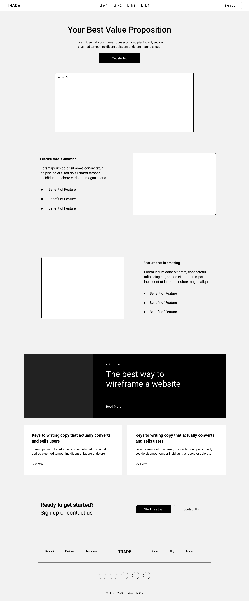
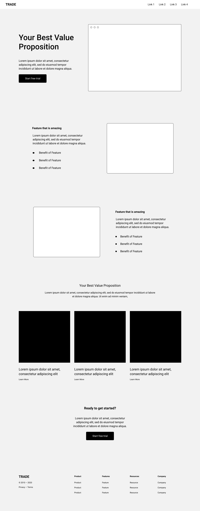

# Assignment 02

**Course Title**: Web Development

**Course Code**: IRM1005 / ITEC1005

**Semester**: Fall 2023

**Due Date**: 11:59 PM on October 19, 2023

**Assessment**: This assignment is worth 15% of your final grade and marked out of 100.

## TLDR

1. Build and style one (1) awesome looking web page using `HTML` and `CSS` that works in desktop mode and satisfies all content and submission requirements for this assignment.
2. Commit your code to your assignment repository in GitHub.
3. Turn on GitHub Pages in your repository to host your web page online.

## Description

This assignment will assess both your ability to structure content with semantic `HTML` tags, format text, include images and links, and apply `CSS` to a page that brings your amazing design to life. 

Students will also be assessed on their ability to commit their code to GitHub and activate the GitHub pages service.

Create and host a web page that meets the following requirements:

- Build and style one (1) web page with a file name `index.html`
- Web page must render well in desktop mode
- `CSS` must be stored in a seperate file and not be embedded in your `HTML`
- Web page must meet the minimum content requirements identified within this document
- Web page must have valid and compliant HTML and CSS as assessed by the `W3C Validator`
- You must use the GitHub Repository generated by GitHub Classrooms for the assignment
- Web page must be hosted using GitHub Pages service
- Web page must be reachable by a browser on the public internet
- You do not need to worry about mobile mode when applying `CSS` to your page 

## Table of contents

- [Content requirements](#content-requirements)
- [Design inspiration](#design-inspiration)
- [Acceptance criteria](#assignment-acceptance-criteria)
- [Grading rubric](#grading-rubric)
- [Late submissions](#late-submissions)
- [Checklist](#checklist)
- [Submitting your work](#submitting-your-work)
- [Frequently Asked Questions (FAQ)](#frequently-asked-questions-faq)
- [Helpful Links](#helpful-links)

## Content requirements

For the actual content for your web page, you can select anything you want, **including what you worked on for your Assignment 01**, as long as it meets the structural requirements defined further below. Here are some examples of the content that you can write and what you can build:

- Personal blog page / article
- Short story
- Corporate landing page
- Home page for a Social Enterprise
- Conference home page
- Online resume
- Product landing page
- Displaying of cool data

### Structural requirements

The web page that you are building must have the following **minimum requirements**. You may build out your web page with even more content than this if you would like, though no additional marks will be awarded.

The only difference from Assignment 01 is the form has been removed and replaced with a Call to Action (CTA) section.

The design inspiration section below has a couple of visual examples of these content requirements that you can use as inspiration for your own designs.

- Header Section
  - Logo
  - Site name
  - Navigation links
    - Minimum of three (3) navigation menu items
- Main Section
  - Hero section
    - Includes one (1) image
  - Three (3) additional content sections (for example)
    - Customer testimonials
    - Product descriptions and screenshots
    - Important data
    - Frequently asked questions
    - Pricing information
  - Call to action 
    - section on a website designed to prompt visitors to take specific actions
    - sign up for a newsletter
    - request a quote
    - link to a page
- Footer Section
  - Logo
  - Site name
  - Navigation links
    - Minimum of three (3) navigation menu items
  - Other optional footer elements such as address and contact information
  - Year and Copyright symbol

## Design inspiration 

Here are two wireframes that you can draw inspiration from when coming up with your own designs. If you are looking for more insipration check out [One Page Love](https://onepagelove.com).

## Acceptance criteria

- Publish your code on GitHub using the GitHub classrooms generated repository
- Use the GitHub Pages service to host your web page
- GitHub time stamps on your project files will be used to asses when the assignment was submitted
- Ensure you have a license file in your repository (recommend MIT license)

## Grading rubric

The creation and posting of this web page is worth 15% of your final grade and marked out of 100.

| Criteria                | Total&nbsp;Marks | How we define excellence                                                                                                                                                                                                                                                                                                              |
| ----------------------- | ---------------- | ------------------------------------------------------------------------------------------------------------------------------------------------------------------------------------------------------------------------------------------------------------------------------------------------------------------------------------- |
| Code quality (HTML and CSS)                  | **10%**          | The HTML code submitted is well formed, and structured. Appropriate semantic elements are used throughout the document. Correct use of headings `<h1-h6>` and heading structure. The web page has the appropriate meta tags in the `<head>` to set the charset and viewport values. The page `<title>` has been set from the default. |
| Header                  | **10%**          | The `<header>` section has been added to the page and meets all content requirements.                                                                                                                                                                                                                                                 |
| Main - Hero Section     | **10%**          | The `<main>` element has a hero that is the first section within `<main>`. This section incorporates an image within the section and includes some text, with the possibility of links.                                                                                                           |
| Main - Content Sections | **30%**          | Three content sections have been added to the `<main>` section of the document. Each content section should have their own heading structure starting at an `<h2>` as well as additional structured content that inludes text, lists, links, images and other well formatted `html`.                                                  |
| Main - Call to Action (CTA)    | **10%**          | A `<section>` added to `<main>` that incorporates a well formatted and designed Call to Action. The CTA section should have its own heading structure starting at an `<h2>` as well as additional structured content that inludes text, lists, links, images and other well formatted `html` as needed.                                                                                            |
| Footer                  | **10%**          | The `<footer>` section has been added to the page and meets all content requirements.                                                                                                                                                                                                                                                 |
| W3C Compliance          | **10%**          | There are no validation errors found in the code for either the HTML or CSS.                                                                                                                                                                                                                                                                                     |
| GitHub&nbsp;submission  | **10%**          | The HTML content is added to the `index.html` file and CSS is added to the `style.css` file. The repository has both the assignment README.md file and a LICENSE file that contains the MIT license. GitHub Pages services has been correctly activated.                                                                              |

## Late submissions

- If you are ill or any other issues arise that are beyond your control, please email [neil.mispelaar@carleton.ca](mailto:neil.mispelaar@carleton.ca) before the specified due date to request a one week extention.
- If you fail to obtain an extentaion or fail to inform the instructor of any extenuating circumstances that cause a delay in your submission by the posted due date, you will receive a mark of **Zero (0)** for the assignment.

## Checklist

To help with your submission, make sure that you have reviewed the following items

- [x] Your code is committed and pushed to the GitHub repo that GitHub Classrooms created for you
- [x] The web page fulfills the minimum content requirements
- [x] [GitHub Pages](https://github.com/orgs/irm1005-itec1005-fall-2023/discussions/4) is activated for your repo and your web page is live and accessible. If you are unsure, send your link to a team member and see if they can access your site from their machine.
- [x] The web page passes [W3C validation](https://validator.w3.org/#validate_by_uri) for both `HTML` and `CSS`

## Submitting your work

Your work must be submitted to your Assignment GitHub repository, which is automatically generated when you accept the assignment through GitHub Classrooms.

When you complete your work, commit and push your code to your repository. There is nothing else that you need to do to mark your assignment as completed.

There are a few ways that you can submit your work to your Assignment repository:

- Clone your GitHub repository, work off of your local machine, and commit your changes through VSCode (recommended)
- Use the GitHub code editor web interface to paste your completed code right into GitHub
- Use a developer container such as GitHub Code Spaces, StackBlitz or replit

## Frequently Asked Questions (FAQ)

<dl>
  
  <dt>What type of content should I include in the web page that I am building?</dt>
  <dd>You can build anything you want that meets the content requirements. If you want to build a portfolio site - go for it! If you want to build the home page of an e-commerce store - that's cool too! If you want to build a site that emphasis on a social good or social enterprise or cause, that's awesome too.</dd>
  
  <dt>Does the web page have to work in both mobile and desktop</dt>
  <dd>No! You only need to make your web page work in desktop mode. Don't worry about mobile mode for this Assignment.</dd>

  <dt>Can I use my code from Assignment 01</dt>
  <dd>Yes. Absolutely. You are permitted to use the code you wrote for your Assignment 01 as the baseline <code>HTML</code> for this assignment.</dd>
 
  <dt>Can I use lorem ipsum text in my webpage</dt>
  <dd>You may use lorem ipsum if you need to but it is recommended that you try to use relevant and intersting content. Though, if you don't have relevant content you are absolutely permitted to use <a href="https://www.lipsum.com">lorem ipsum</a>, <a href="https://baconipsum.com">bacon ipsum</a>, or <a href="https://veganipsum.me">vegan ipsum</a> in your web page. Keep in mind that this should not be used in cases where the meaning of the text is important, for example the call to action buttons in the hero or elements in the form.</dd>

  <dt>Do I need to include sketches, concepts, or initial content drafts?</dt>
  <dd>No. You are only being assessed on the quality of your <code>HTML</code> and <code>CSS</code> code, and what you submit to your GitHub repository. </dd>
 
  <dt>Can I use trademarked or copywritten material on my page?</dt>
  <dd>Yes! As this is for educational purposes, all of the source is open, and no one is trying to sell their design or code you can absolutely use trademarked or copywritten material. Just add a comment in your code where you got the material.</dd>

  <dt>How do I cite my sources</dt>
  <dd>Just add a <code>HTML</code> comments in your <code>index.html</code> file and describe where you got the information from. If you use GitHub Copilot identify which lines in your files were generated and for ChatGPT make sure you include the prompt that you used.</dd> 
 
</dl>

## Helpful links

### HTML Resources

- [Intro to HTML - Prof3ssorSt3v3](https://www.youtube.com/watch?v=KUmuiqV1xME&list=PLyuRouwmQCjncCz8JChyPNRBvm2ONGYa2)
- [HTML Tutorial - MDN](https://developer.mozilla.org/en-US/docs/Learn/HTML)
- [Colour palettes](https://coolors.co)
- [One page love](https://onepagelove.com)

### Images and Icons

- [Pexels](https://www.pexels.com)
- [Unsplash](https://unsplash.com)
- [The noun project](https://thenounproject.com)

### GitHub

- [A short video explaining what GitHub is](https://www.youtube.com/watch?v=w3jLJU7DT5E&feature=youtu.be)
- [Git and GitHub learning resources](https://docs.github.com/en/github/getting-started-with-github/git-and-github-learning-resources)
- [Understanding the GitHub flow](https://guides.github.com/introduction/flow/)
- [How to use GitHub branches](https://www.youtube.com/watch?v=H5GJfcp3p4Q&feature=youtu.be)
- [GitHub's Learning Lab](https://lab.github.com/)
- [Education community forum](https://education.github.community/)
- [GitHub community forum](https://github.community/)

### Git

- [Interactive Git training materials](https://githubtraining.github.io/training-manual/#/01_getting_ready_for_class)
